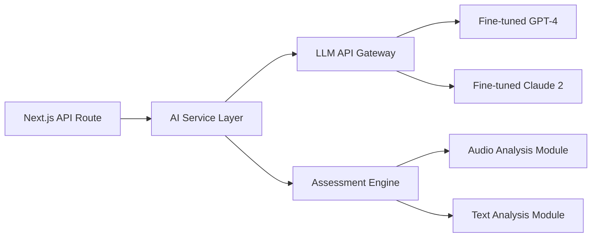

# AI Integration Architecture for Project Nexus  
**Version:** 1.0  
**Date:** June 9, 2025  

## 1. Overview  
This document outlines the architecture for AI integration in Project Nexus, operating within the client-agnostic Next.js API routes as defined in the System Architecture Design.

## 2. AI Service Components  

## 3. Request Flow  
1. Client sends assessment data to Next.js API route
2. API route authenticates request and forwards to AI Service Layer
3. AI Service routes to appropriate module:
   - Text/quiz submissions → Assessment Engine
   - Content generation requests → LLM API Gateway
4. Results processed and returned through API route

## 4. Assessment Engine  
- **Multi-modal Support:**
  - Audio: Whisper-based speech-to-text + prosody analysis
  - Text: Semantic similarity scoring + rubric evaluation
  - Quizzes: Automatic grading with explanation
- **Feedback Generation:**  
  Constructive suggestions based on performance gaps
- **Adaptive Learning Signals:**  
  Flags knowledge gaps to curriculum engine

## 5. Content Generation  
- **Augmented Expert Workflow:**  
  1. SME provides topic seed  
  2. LLM generates draft content  
  3. SME edits/validates  
  4. System publishes final version  
- **Strict Validation:**  
  All AI-generated content requires human approval

## 6. Security & Compliance  
- **Data Anonymization:**  
  PII stripping before processing
- **EU GDPR Compliance:**  
  Right to explanation for AI decisions
- **Audit Logging:**  
  All AI interactions recorded