# AI Integration Architecture for Project Nexus  
**Version:** 1.0  
**Date:** June 9, 2025  

## 1. Overview  
This document outlines the architecture for AI integration in Project Nexus, operating within the client-agnostic Next.js API routes as defined in the System Architecture Design.

## 2. AI Service Components  


## 3. Request Flow
1. Client sends assessment data to Next.js API route
2. API route authenticates request and forwards to AI Service Layer
3. AI Service routes to appropriate module:
   - Text/quiz submissions → Assessment Engine
   - Content generation requests → LLM API Gateway
4. API Gateway selects optimal provider based on:
   - Required capabilities
   - Current API costs
   - Performance requirements
5. Results processed and returned through API route

## 4. Assessment Engine  
- **Multi-modal Support:**
  - Audio: Whisper-based speech-to-text + prosody analysis
  - Text: Semantic similarity scoring + rubric evaluation
  - Quizzes: Automatic grading with explanation
- **Feedback Generation:**  
  Constructive suggestions based on performance gaps
- **Adaptive Learning Signals:**  
  Flags knowledge gaps to curriculum engine

## 5. Content Generation  
- **Augmented Expert Workflow:**  
  1. SME provides topic seed  
  2. LLM generates draft content  
  3. SME edits/validates  
  4. System publishes final version  
- **Strict Validation:**  
  All AI-generated content requires human approval

## 6. Prompt Engineering Strategy

### 6.1 Core Prompt Patterns
```text
// Audio feedback analysis prompt
"As an expert educator, analyze this audio response from a learner.
Identify 3 strengths and 3 areas for improvement in their understanding.
Focus on clarity, technical accuracy, and conceptual grasp.
Return analysis in this JSON format: {strengths: [], improvements: []}"

// Text summarization prompt
"Summarize this technical content for a beginner audience in 3 bullet points.
Maintain accuracy while simplifying terminology.
Each bullet should be under 15 words."
```

### 6.2 Specialized Task Prompts
- **Content Generation**:
  ```text
  // Gemini API prompt
  "Generate educational content about [TOPIC] for [AUDIENCE LEVEL].
  Include key concepts, practical examples, and learning objectives.
  Format in Markdown with section headers."
  
  // OpenRouter prompt
  "As a subject matter expert, create a lesson plan about [TOPIC]
  with duration of [X] minutes. Include activities, assessments,
  and required materials."
  ```
- **Error Diagnosis**: (TBD: Master Spec Section 4.3)
- **Adaptive Learning**: (TBD: Master Spec Section 4.4)

## 7. Structured Feedback Schema
```typescript
interface AIFeedback {
  type: "audio" | "text" | "quiz";
  score: number; // 0-100
  dimensions: {
    accuracy: number; // 0-5
    completeness: number; // 0-5
    clarity: number; // 0-5
  };
  suggestions: string[]; // Specific improvement suggestions
  highlights: { // For text/audio analysis
    text: string;
    comment: string;
    type: "strength" | "weakness";
  }[];
}
```

## 8. Abuse & Cost Mitigation

### 8.1 Prompt Injection Defense
- Input sanitization pipeline
- Suspicious pattern detection
- Context-aware validation

### 8.2 Cost Controls

```mermaid
graph TD
    A[API Request] --> B{Rate Limit?}
    B -->|Yes| C[Process Normally]
    B -->|No| D[Return 429]
    C --> E{High Cost?}
    E -->|Yes| F[Use Cost-Effective Model]
    E -->|No| G[Use Optimal Model]
    F --> H[Gemini/OpenRouter]
    G --> I[GPT-4/Claude]
```


### 8.3 Monitoring
- Real-time API cost dashboard
- Alert thresholds for abnormal usage
- Monthly budget caps per feature

## 9. Security & Compliance
- **Data Anonymization:**  
  PII stripping before processing
- **EU GDPR Compliance:**  
  Right to explanation for AI decisions
- **Audit Logging:**  
  All AI interactions recorded