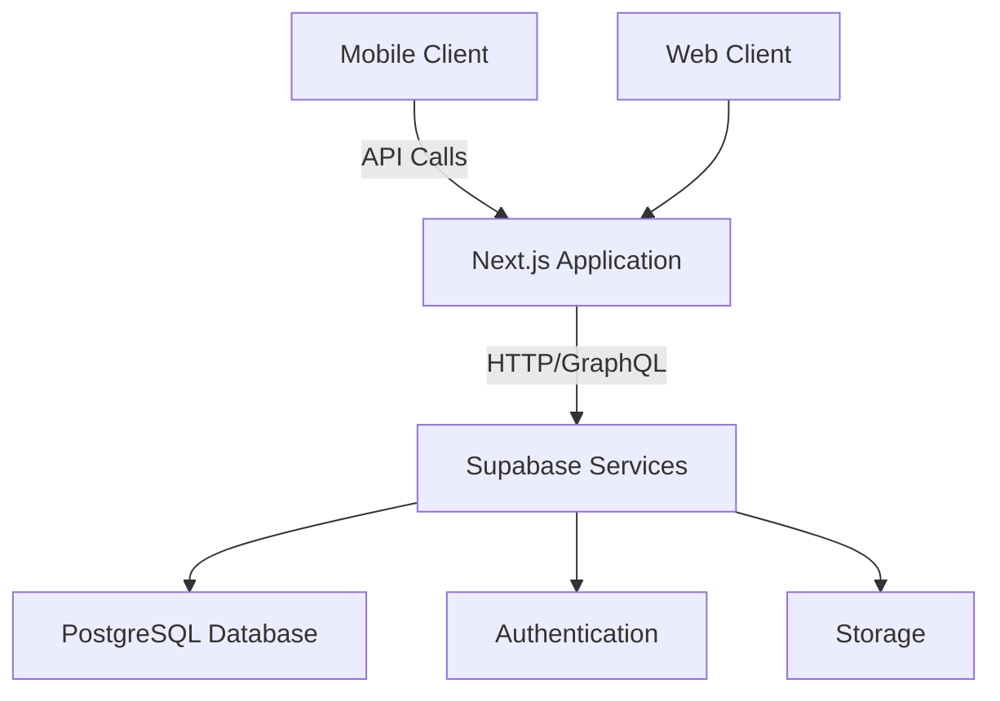

# System Architecture Design for Project Nexus  
**Version:** 1.0  
**Date:** June 9, 2025  

## 1. Overview  
This document outlines the system architecture for Project Nexus, derived from the [Master Product & Business Specification](business_plan.md) with technical implementation details. The architecture follows a modern, scalable approach using Next.js and Supabase.

## 2. Core Architecture  



- **Next.js Application:** Serves as the main application layer
- **Supabase Services:** Remote BaaS providing database, auth, and storage
- **Client Agnosticism:** All clients interact through Next.js API routes

## 3. API Layer Strategy  
- **Implementation:** Next.js API Routes
- **Key Characteristics:**
  - Stateless design
  - Pure JSON responses (no web-specific markup)
  - Versioned endpoints (v1/, v2/)
  - Swagger/OpenAPI documentation
- **Mobile Support:** Contracts designed for direct mobile consumption

## 4. Caching Strategy  
### 4.1 Next.js Data Cache  
- Caches Supabase data fetches at request level
- Configurable TTL per data type
- Automatic invalidation on data mutations

### 4.2 Next.js Full Route Cache  
- Static page generation for public content
- ISR (Incremental Static Regeneration) for dynamic content
- Edge caching via Vercel

### 4.3 API Route Caching  
- Redis-based caching for high-traffic endpoints
- Cache key patterns: `api:route:params`
- Write-through cache strategy

## 5. Local Development Environment  
### Docker Compose Setup  
```yaml
version: '3.8'
services:
  next-dev:
    image: node:18
    working_dir: /app
    volumes:
      - .:/app
    ports:
      - "3000:3000"
    command: npm run dev
    environment:
      SUPABASE_URL: ${SUPABASE_URL}
      SUPABASE_KEY: ${SUPABASE_KEY}

  next-proxy:
    image: node:18
    working_dir: /app
    volumes:
      - .:/app
    ports:
      - "3001:3000"
    command: npm run dev
    environment:
      HTTP_PROXY: http://proxy.example.com:8080
      SUPABASE_URL: ${SUPABASE_URL}
      SUPABASE_KEY: ${SUPABASE_KEY}
```

- **Services:**
  1. `next-dev`: Standard development environment
  2. `next-proxy`: Routes traffic through proxy for testing
- **Configuration:** Environment variables for Supabase connection