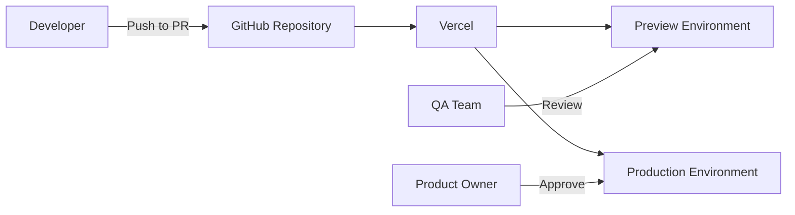

# CI/CD Pipeline Design for Project Nexus  
**Version:** 1.0  
**Date:** June 9, 2025  

## Overview  
This document outlines the Continuous Integration and Continuous Deployment (CI/CD) pipeline for Project Nexus, leveraging Vercel and GitHub integration.

## Pipeline Architecture  

## Workflow Stages  
1. **Code Commit**  
   - Developers push code to feature branches  
   - Pull requests trigger Vercel preview builds  

2. **Preview Deployment**  
   - Automatic build on Vercel  
   - Unique URL per PR (e.g., `pr-23.nexus.vercel.app`)  
   - Automated Lighthouse performance tests  

3. **Quality Gate**  
   - Required approvals:  
     - 1 Frontend Engineer  
     - 1 Backend Engineer  
     - Product Owner (for UX changes)  
   - Automated checks:  
     - ESLint/Typescript validation  
     - Unit test coverage > 80%  
     - Build success  

4. **Production Deployment**  
   - Merge to `main` triggers production build  
   - Zero-downtime deployment (Vercel atomic deploys)  
   - Canary release option for major changes  

5. **Post-Deployment**  
   - Automated smoke tests  
   - Error monitoring (Sentry integration)  
   - Performance monitoring (Vercel Analytics)  

## Branching Strategy  
- `main` - Production-ready code (protected)  
- `staging` - Pre-production testing (protected)  
- `feature/*` - Feature development  
- `hotfix/*` - Critical bug fixes  

## Environment Variables  
| Environment | Purpose | Example URL |  
|-------------|---------|-------------|  
| Production | Live users | `nexus-app.com` |  
| Preview | PR review | `pr-*.nexus.vercel.app` |  
| Development | Local testing | `localhost:3000` |  

## Rollback Procedure  
1. Revert problematic commit in GitHub  
2. Vercel automatically redeploys previous version  
3. Instant rollback (avg. < 30 seconds)  

## Monitoring & Alerts  
- **Vercel Logs:** Real-time deployment logs  
- **GitHub Actions:** Build status notifications  
- **Slack Alerts:**  
  - Deployment success/failure  
  - Performance regressions  
  - Error spikes