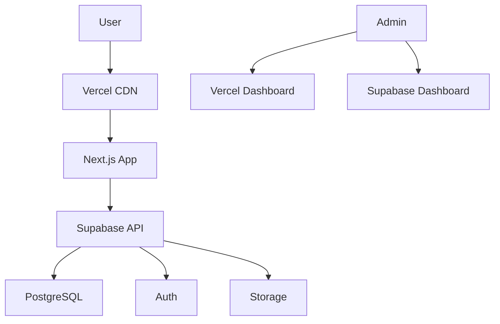

# Infrastructure and Deployment Plan for Project Nexus  
**Version:** 1.0  
**Date:** June 9, 2025  

## 1. Overview  
This document outlines the production infrastructure and deployment strategy for Project Nexus, using Vercel for frontend hosting and Supabase for backend services.

## 2. Production Environment Architecture  

## 3. Infrastructure Components  
### 3.1 Vercel Hosting  
- **Plan:** Pro Plan  
- **Features:**  
  - Global CDN with 23+ edge locations  
  - Automatic SSL certificates  
  - DDoS protection  
  - Serverless functions for API routes  
  - Automatic scaling  

### 3.2 Supabase Services  
- **Plan:** Pro Plan ($25/month)  
- **Components:**  
  - PostgreSQL Database (8GB RAM, 2 vCPU)  
  - Authentication with OAuth providers  
  - Object Storage with CDN  
  - Realtime functionality  

## 4. Deployment Workflow  
1. **Code Merged to Main Branch**  
   - Triggers Vercel production build  
   - Runs automated tests  
2. **Build Process**  
   - Next.js static optimization  
   - Serverless function bundling  
   - Asset compilation  
3. **Deployment**  
   - Zero-downtime deployment  
   - Atomic releases (instant rollback)  
   - Canary releases for major updates  

## 5. Environment Configuration  
| Environment Variable | Production Value | Purpose |  
|----------------------|------------------|---------|  
| `NEXT_PUBLIC_SUPABASE_URL` | `https://xyz.supabase.co` | Supabase API endpoint |  
| `SUPABASE_SERVICE_KEY` | `*****` | Server-side operations |  
| `NEXTAUTH_URL` | `https://nexus-app.com` | Authentication callback |  

## 6. Monitoring & Alerting  
- **Vercel Analytics:** Real-time performance metrics  
- **Sentry:** Error tracking and monitoring  
- **Supabase Logs:** Database query performance  
- **Uptime Robot:** 5-minute availability checks  

## 7. Disaster Recovery  
- **Database Backups:** Daily snapshots (7-day retention)  
- **Rollback Procedure:**  
  1. Revert commit in GitHub  
  2. Vercel automatically redeploys previous version  
  3. Verify functionality  
- **Data Recovery:**  
  - Point-in-time recovery via Supabase  
  - Export database dumps weekly  

## 8. Scaling Strategy  
- **Automatic Scaling:**  
  - Vercel: Unlimited serverless functions  
  - Supabase: Vertical scaling (up to 16GB RAM)  
- **Manual Scaling Triggers:**  
  - > 10,000 MAU: Upgrade Supabase plan  
  - > 50,000 MAU: Add read replicas