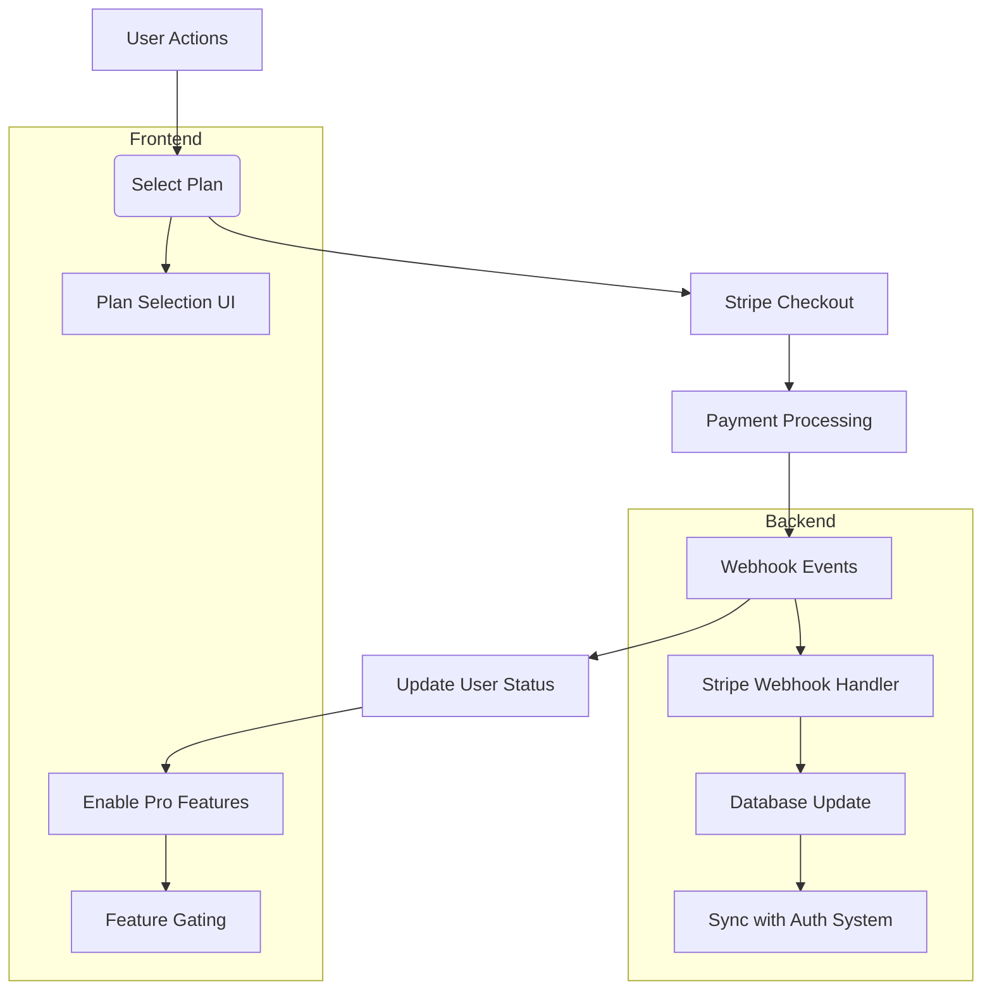
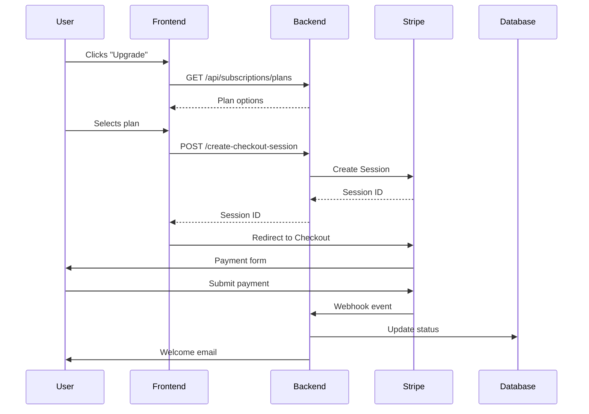

# Stripe Subscription Implementation Plan for Project Nexus
**Version:** 1.0  
**Date:** June 10, 2025  

## Overview
This document details the implementation plan for integrating Stripe subscription management into Project Nexus, enabling premium features through recurring billing.

## Architecture Diagram


## Implementation Details

### 1. Database Schema Extension
```prisma
model Subscription {
  id                 String   @id @default(cuid())
  user               User     @relation(fields: [userId], references: [id])
  userId             String
  stripeSubscription String   @unique
  status             String   // active, canceled, past_due
  planId             String   // free, pro_monthly, pro_annual
  currentPeriodEnd   DateTime
  createdAt          DateTime @default(now())
  updatedAt          DateTime @updatedAt
}
```

### 2. Stripe Integration Endpoints
- `POST /api/subscriptions/create-checkout-session`
- `POST /api/subscriptions/webhook`
- `GET /api/subscriptions/current`

### 3. User Flow


### 4. Feature Gating
**Frontend Component:**
```jsx
const FeatureFlag = ({ feature, children }) => {
  const { subscription } = useSubscription();
  
  if (feature === 'pro' && subscription.status !== 'active') {
    return <UpgradePrompt />;
  }
  
  return children;
};
```

**Backend Middleware:**
```typescript
export const requirePro = (req: Request, res: Response, next: NextFunction) => {
  if (req.user.subscriptionStatus !== 'active') {
    return res.status(403).json({ error: 'Pro subscription required' });
  }
  next();
};
```

### 5. Testing Strategy
| Test Type | Tools | Coverage |
|-----------|-------|----------|
| Unit Tests | Jest, Stripe-mock | Payment flows, edge cases |
| Integration | Cypress, Stripe test cards | Full checkout flow |
| Security | OWASP ZAP, PCI scans | Vulnerability assessment |

### 6. Deployment Plan
1. **Staging Phase** (June 15-20):
   - Test mode integration
   - Team validation
2. **Limited Release** (June 21-30):
   - 10% user rollout
   - Monitor conversion metrics
3. **Full Release** (July 1):
   - Enable for all users
   - Implement monitoring alerts

## Next Steps
Switch to code implementation mode to begin development.